# EFS Filesystem Deployment

  This project demonstrates the creation and configuration of a shared file system using Amazon Elastic File System (EFS) on AWS. 

  EFS provides a scalable, highly available, and cost-effective solution for storing and sharing data across multiple EC2 instances.

# 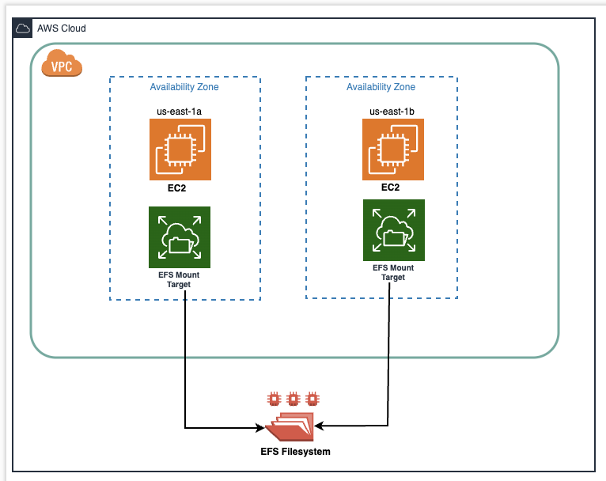

# Resources Utilized

  EFS Filesystem: An Elastic File System is established to furnish scalable and shared storage across multiple EC2 instances.

  Security Group for EFS: A security group is devised to regulate the ingress and egress traffic for the EFS.

  EC2 Instances: Two EC2 instances are provisioned to access the shared EFS filesystem.

# Benefits of EFS:

  **Scalability:** EFS automatically scales storage capacity to meet your application's needs.

  **Durability:** Data is replicated across multiple Availability Zones for high availability and data protection.

  **Performance:** EFS provides consistent performance for concurrent access from multiple EC2 instances.

  **Cost-Effectiveness:** You only pay for the storage you use, making EFS a cost-efficient solution.

# Setup Instructions:

# 1. Create a Security Group for EFS:

  Create a security group to control the inbound and outbound traffic for the EFS. 

  Configure the security group rules as per your requirements.
  
  Create Security group with inbound rule to all ssh trffic from anywhere.
  
  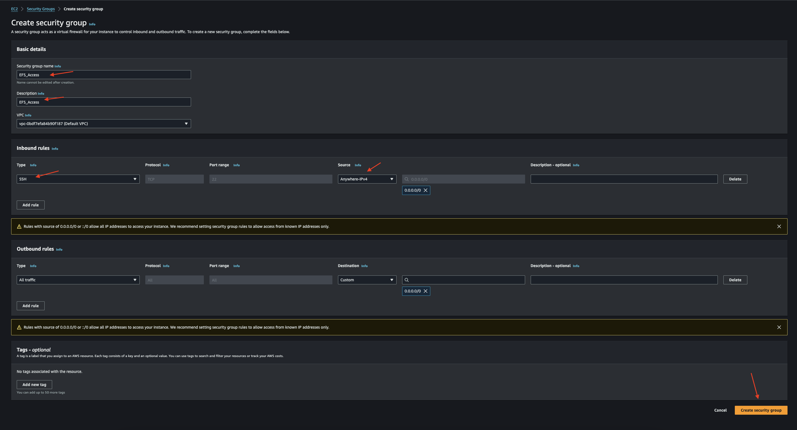

  On your already created security group select inbound rules and edit inbound rules.
  
  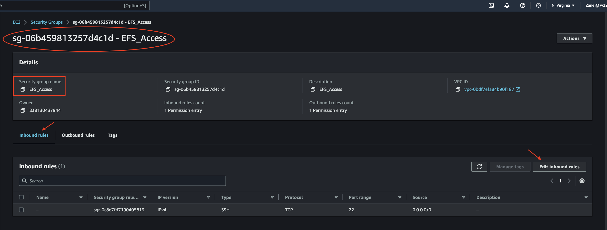

  Add rule
  
  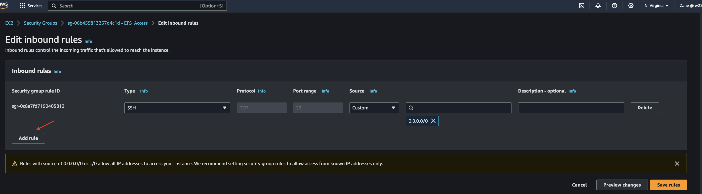

  Select NFS to allow traffic from your already created security group (mine = EFS_Access) and Save.
  
  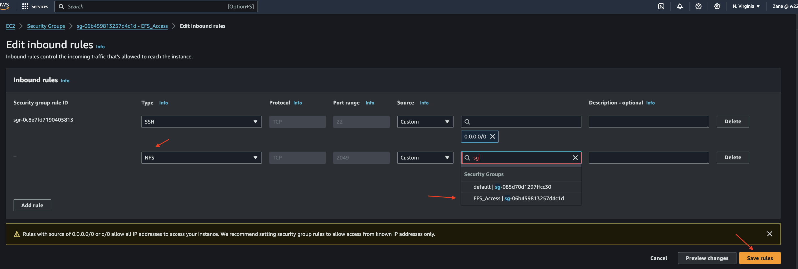

  Completed Security group for EFS.(EFS_Access)
  
  # 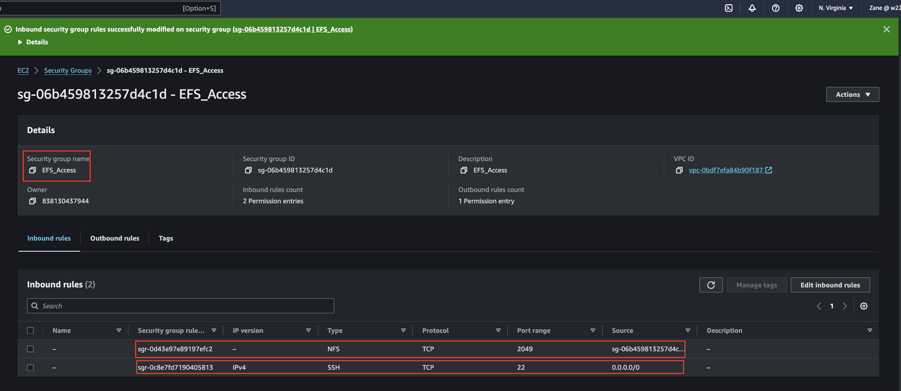

# 2. Launch EC2 Instances:

  Launch two EC2 instances in different availability zones.

  Ensure that the instances are associated with the security group created for EFS.

  Reapet the EC2 creation step for second Instance.
  
   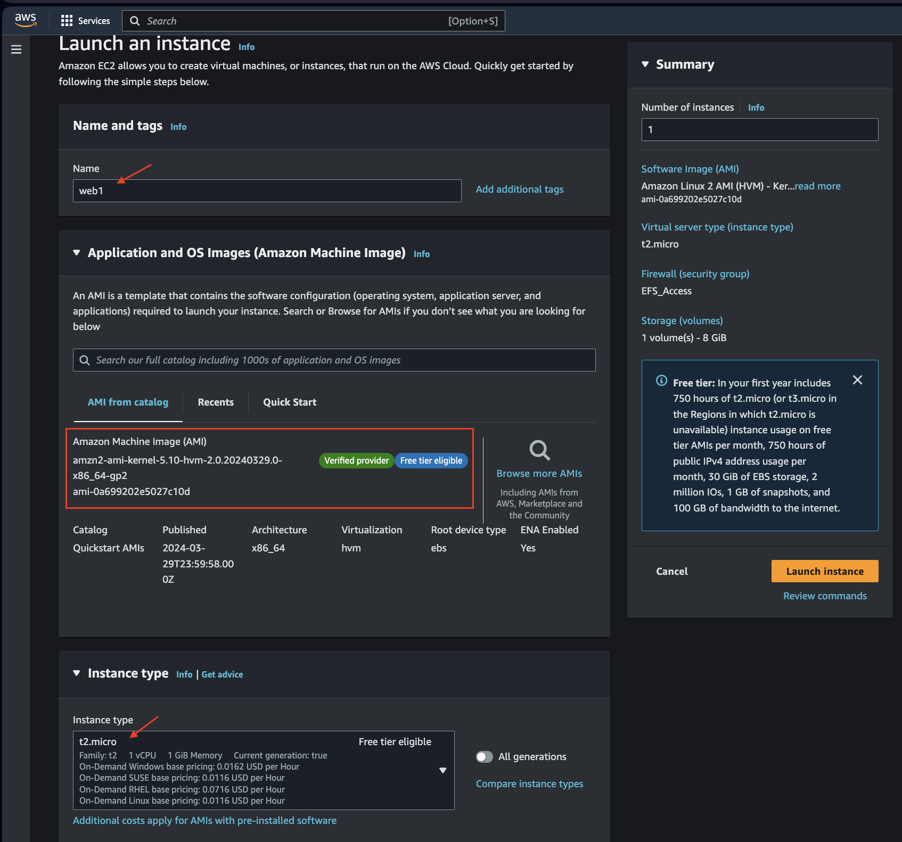

  Create each instance in a different subnet and select exsiting security group and choose the one you created for EFS. 
  
  Launch Instance.
  
  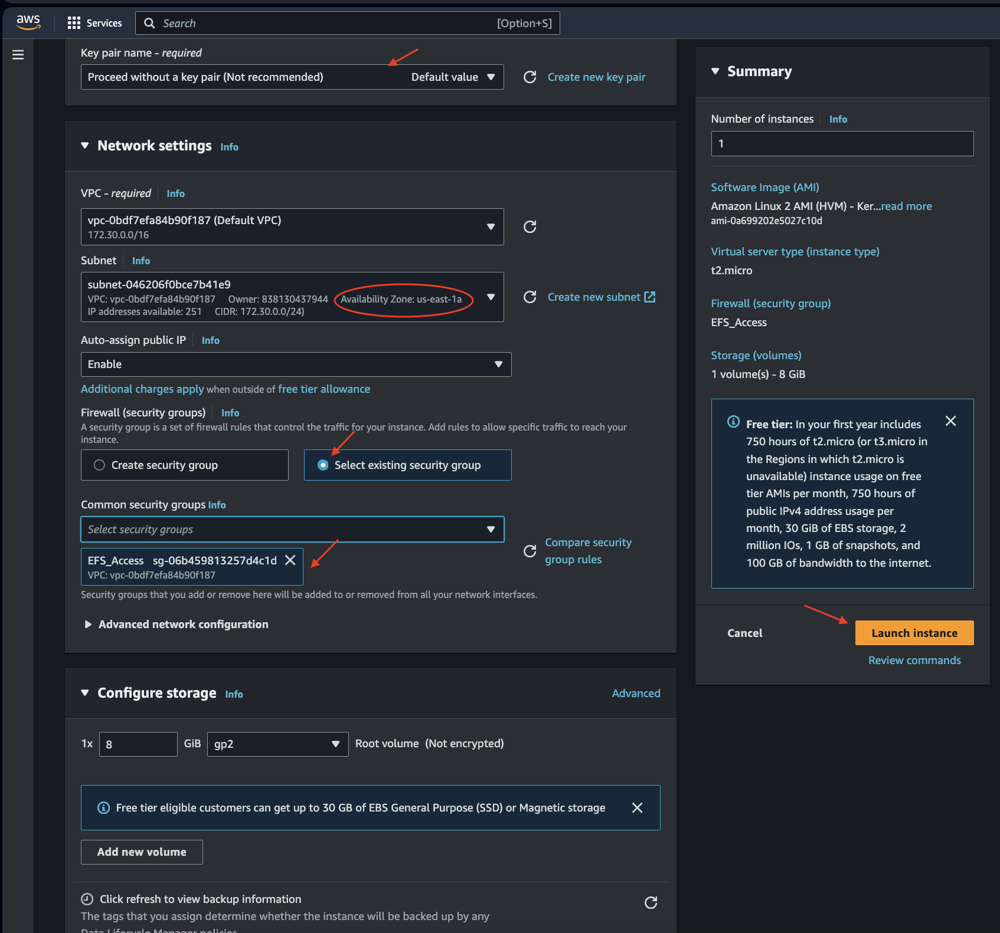

  Created Instances.
  
  # 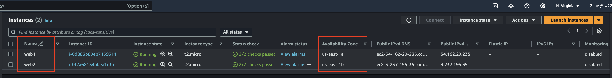

# 3. Create an EFS Filesystem:

  Create an Elastic File System (EFS) filesystem. 

   Created EFS filesystem 
   
  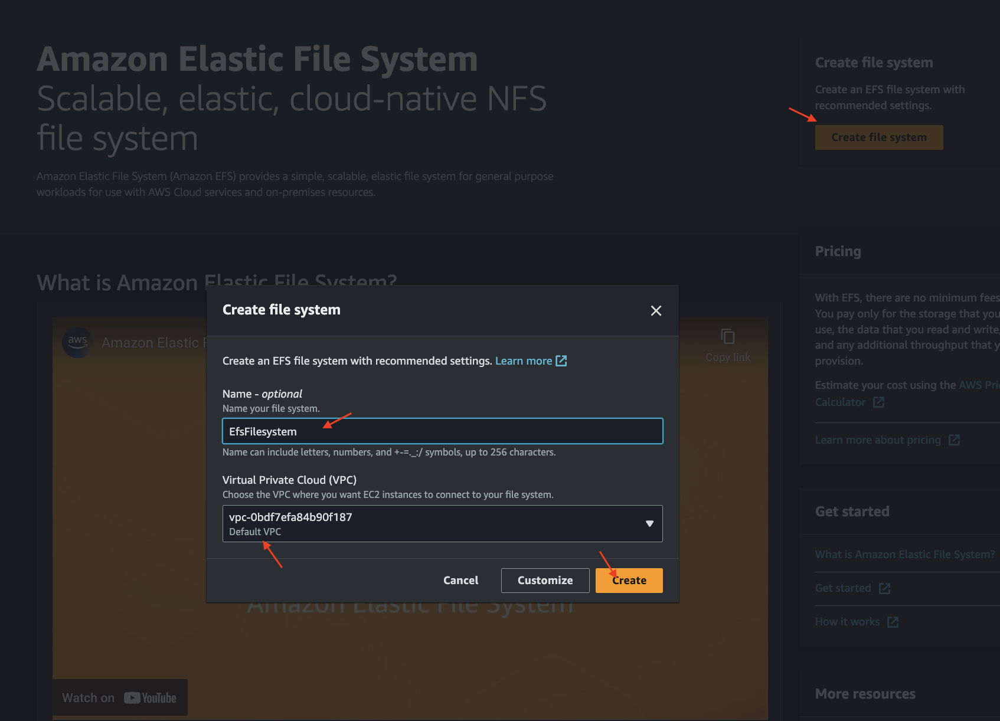

  Click on created EfsFilesystem to configure settings.
  
  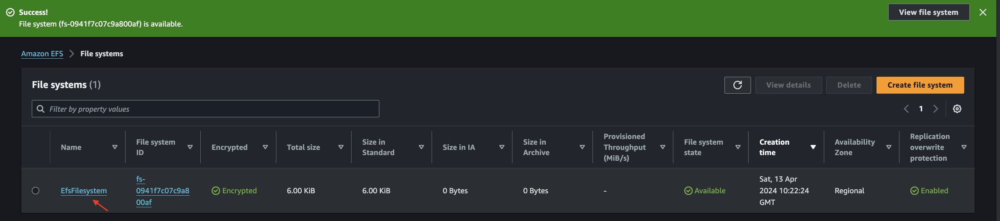

  Configure the filesystem settings.

  Copy DNS Name, Select Network and choose manage

  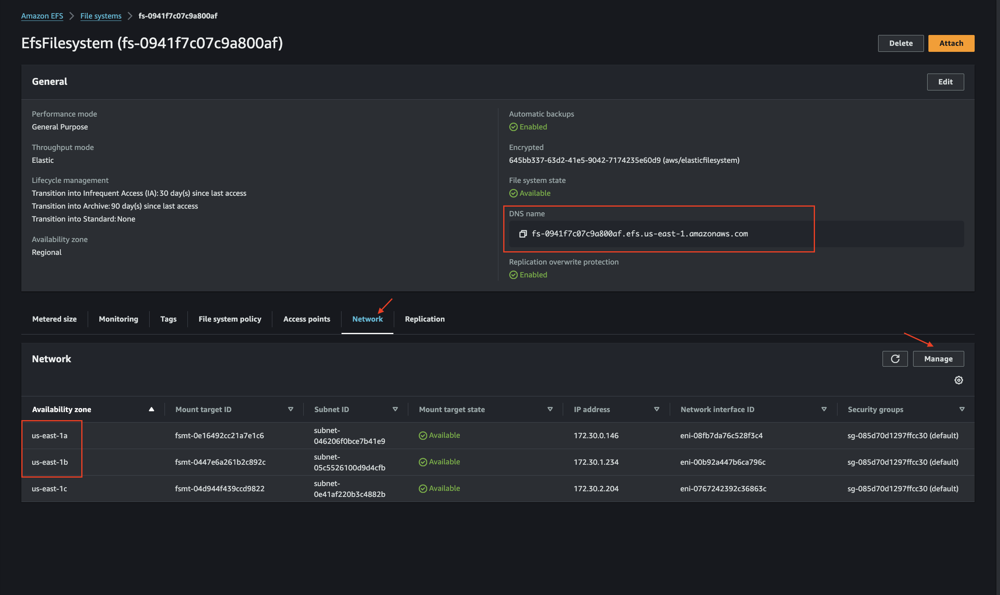

  Choose only availbility zone where your instance was created. 
  
  Delete defult security group and select the one you created ans Save.
  # 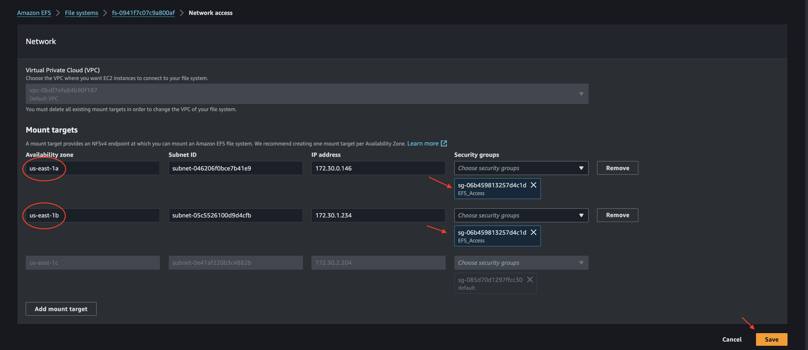

# 4. Mount EFS on EC2 Instances:

  Mount the EFS filesystem on each EC2 instance to enable shared access to the storage. 
  
  Configure the mount options and permissions as required.
  
  Select and Connect instance 1 (web1)

  These steps should be repeated for Instance 2 (web2) on a different Page.
  
  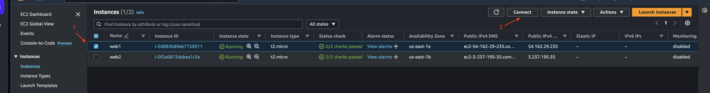

  Select Connect using EC2 Instance connect and Connect.
  
  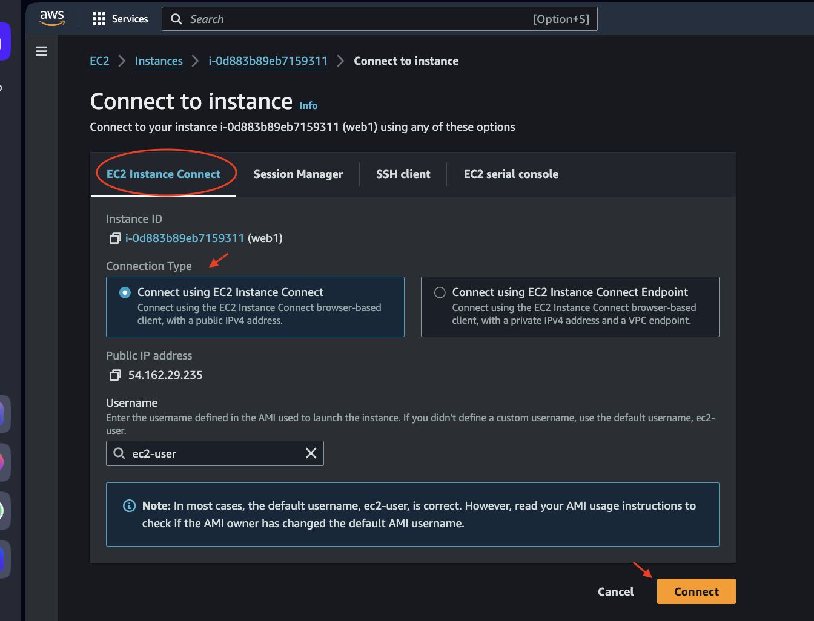

  Run the provided Linux Command on each of the Instances (web1 and Web2). 
  
  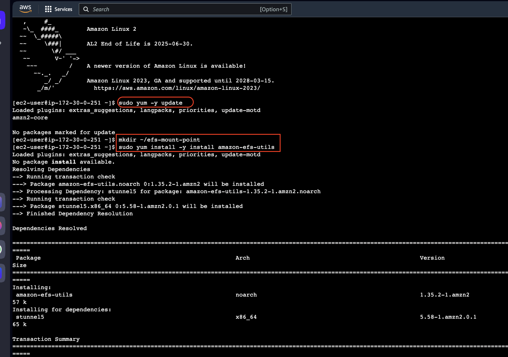

  Incude your DNS Name on the command provided and run command to mount your Instance.

  Change directory to efs-mount-point

  check files in Directory (ls)

  **Note: Make directory only in one AZ** (web1)
  sudo mkdir <filename>
  
  ls to see created directory

  **Note touch <filename> only in One AZ**(web2)

  # 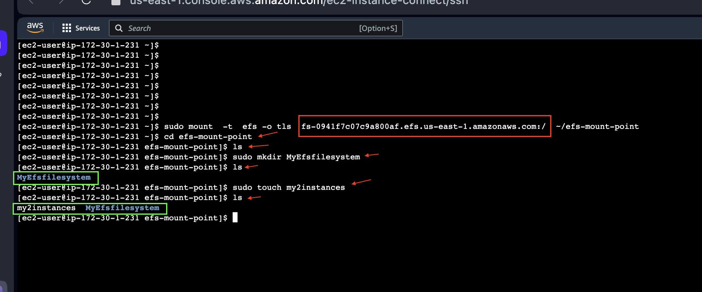
 

# 5. Test the Shared Filesystem:

  Create files and directories on the mounted EFS filesystem from one EC2 instance and verify that they are accessible from the other EC2 instance. 

  Incude your DNS Name on the command provided and run command to mount your Instance.

  Change directory to efs-mount-point

  check files in Directory (ls) to see created file from 1st Instance (web1)
  
  # 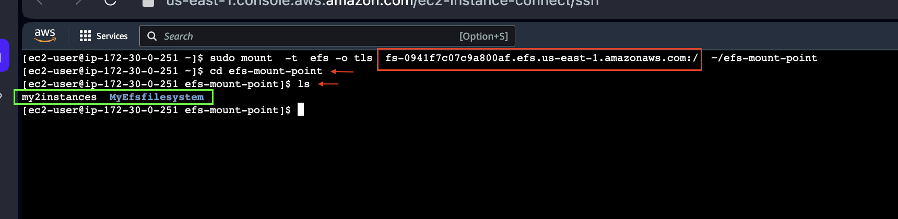

